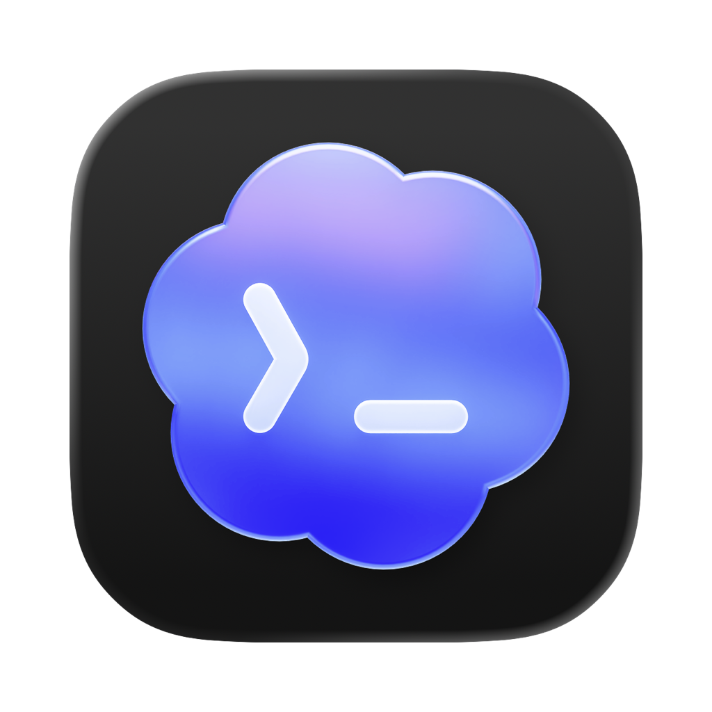

<div align="center">

<p>
  
</p>

# Argus

**Self-hosted company of AI agents for your software projects.**

Argus watches repos, production signals, support inboxes, and chat channels,
then routes work through approval-gated agents that can explain status, draft
fixes, and open safe pull requests.

<p>
  <a href="https://github.com/dangogit/argus/releases"></a>
  <a href="LICENSE"></a>
  <a href="pyproject.toml"></a>
  <a href="docs/README.md"></a>
  <a href="https://github.com/dangogit/argus/discussions"></a>
  <a href="SECURITY.md"></a>
</p>

<p>
  <a href="docs/README.md"></a>
  <a href="docs/slack-live.md"></a>
  <a href="docs/inbound.md"></a>
  <a href="docs/inbound.md"></a>
  <a href="docs/support.md"></a>
  <a href="docs/engines.md"></a>
  <a href="docs/engines.md"></a>
</p>

[Quickstart](docs/quickstart.md) |
[Docs](docs/index.md) |
[Vision](VISION.md) |
[FAQ](docs/faq.md) |
[Showcase](docs/showcase.md) |
[Slack Setup](docs/slack-live.md) |
[Configuration](docs/configuration.md) |
[Security](SECURITY.md) |
[Discussions](https://github.com/dangogit/argus/discussions) |
[Third-Party Notices](THIRD_PARTY_NOTICES.md) |
[Agent Install Skill](skills/argus-live-onboarding/SKILL.md)

</div>

Argus is for operators who want a private, always-on agent layer over their
projects without handing production keys or repo control to a hosted black box.
It runs on your machine or server, uses your installed agent CLI, keeps secrets
in your private env, and defaults to propose-only changes.

The Python package name is `argus-agent`; the installed command is `argus`.
Argus is pre-1.0 alpha. Treat the host machine and whoever can run `argus` as
trusted operators.

New install? Start with [Quickstart](docs/quickstart.md), then run
[`argus onboard project`](docs/live-onboarding.md) for one real repo. If Codex
or Claude Code is installing Argus for you, point it at
[`skills/argus-live-onboarding/SKILL.md`](skills/argus-live-onboarding/SKILL.md).
Setup questions belong in
[GitHub Discussions](https://github.com/dangogit/argus/discussions).

## Highlights

| What | Why it matters |
|---|---|
| Agent manager chat | Ask Argus in Slack, Telegram, CLI, or webhook-backed channels what is happening in a repo. |
| Production signal routing | Poll GitHub, Vercel, Firebase, Supabase, Sentry, PostHog, Fly, uptime, Postgres, OpenAPI, webhooks, and support email. |
| Durable agent pipeline | Postgres queues, role pipelines, approvals, action records, retries, and operator-visible state. |
| Safe draft PR loop | Worktree isolation, QA gating, secret scanning, daily caps, retro lessons, and draft PRs by default. |
| Local engine choice | Use `echo` for smoke tests, then Codex, Claude Code, or Hermes for real work. |
| Always-on operation | Render launchd or systemd units for `serve`, `up`, `poll`, watchdog, backup, and daily brief jobs. |
| Agent-friendly install | `AGENTS.md`, `llms.txt`, and an installer skill tell Codex or Claude Code how to inspect, configure, and prove the setup. |

## Install

Recommended source install:

```bash
curl -fsSL https://raw.githubusercontent.com/dangogit/argus/main/scripts/install.sh | sh
argus --version
```

Windows PowerShell install:

```powershell
irm https://raw.githubusercontent.com/dangogit/argus/main/scripts/install.ps1 | iex
argus --version
```

Manual GitHub install:

```bash
pipx install --python python3.12 "git+https://github.com/dangogit/argus.git"
argus --version
```

Alternative with `uv`:

```bash
uv tool install --python 3.12 "git+https://github.com/dangogit/argus.git"
argus --version
```

Source checkout for contributors:

```bash
git clone https://github.com/dangogit/argus.git
cd argus
python3.12 -m venv .venv  # or any Python 3.11+
. .venv/bin/activate
python -m pip install -e '.[dev]'
argus --version
```

On macOS, `/usr/bin/python3` can be older than 3.11. Use Homebrew Python,
`python3.12`, `python3.11`, or another Python 3.11+ interpreter. If your
global `pipx` uses an older interpreter, pass `--python python3.12` or
`--python python3.11`.
On Windows, install Python 3.11+ and Git for Windows first. The PowerShell
installer uses `pipx` when available, otherwise it installs `pipx` for the
current user.

PyPI install after package publication:

```bash
pipx install --python python3.12 argus-agent
```

Package publishing is wired through the Release workflow. It builds Python
distributions on manual runs and publishes to PyPI only from a GitHub release
after PyPI trusted publishing is configured for the `pypi` environment.

Docker CLI image:

```bash
docker build -t argus:local .
docker run --rm argus:local --version
```

The image runs the `argus` command. Mount private config at `/config/argus.yaml`
and runtime data at `/var/lib/argus` when using it beyond version smoke.

## Requirements

- Python 3.11 or newer.
- `pipx` or `uv` for global CLI install, or venv + `pip` for source checkout.
- Postgres with pgvector available and v2 migrations applied.
- Docker with Compose for the documented local Postgres smoke path.
- Git for source installs, plus the `gh` CLI for draft PR creation.
- Optional: Node 22+ for the dashboard.
- Optional: Codex, Claude Code, or Hermes for non-echo engines.

## Start Here

| Goal | Start |
|---|---|
| Prove local runtime with no model keys | [docs/quickstart.md](docs/quickstart.md) |
| Let Codex or Claude Code install Argus | [skills/argus-live-onboarding/SKILL.md](skills/argus-live-onboarding/SKILL.md) |
| Connect a real project | [docs/live-onboarding.md](docs/live-onboarding.md) |
| Configure Slack | [docs/slack-live.md](docs/slack-live.md) and [examples/slack-app-manifest.yaml](examples/slack-app-manifest.yaml) |
| Configure Telegram, WhatsApp, CLI, or generic inbound | [docs/inbound.md](docs/inbound.md) |
| Add Vercel, Sentry, PostHog, Firebase, Supabase, GitHub, uptime, or webhook monitoring | [docs/triage.md](docs/triage.md) |
| Enable PM draft PRs | [docs/pm.md](docs/pm.md) |
| Run always-on workers | [docs/live-onboarding.md](docs/live-onboarding.md) and [docs/operations.md](docs/operations.md) |
| Update or uninstall Argus | [docs/updating.md](docs/updating.md) |
| Answer common setup questions | [docs/faq.md](docs/faq.md) |
| See common deployment paths | [docs/showcase.md](docs/showcase.md) |
| Prepare the repository for public launch | [docs/public-launch.md](docs/public-launch.md) |
| Review security before public exposure | [SECURITY.md](SECURITY.md) and [docs/threat-model.md](docs/threat-model.md) |
| Ask a setup question | [GitHub Discussions](https://github.com/dangogit/argus/discussions) |

For a first local autonomous loop, follow [docs/quickstart.md](docs/quickstart.md).
Before adding live engines, connectors, support inboxes, or notification
channels, read [docs/configuration.md](docs/configuration.md). Copy
`.env.example` to a private env file for runtime secrets.

For Codex, Claude Code, and other coding agents, read [AGENTS.md](AGENTS.md)
first. `llms.txt` provides a compact public index of install and runtime docs.
For private env files, prefer `ARGUS_ENV_FILES=/absolute/path/to/argus.env`.
If you source an env file manually, use `set -a` so `ARGUS_DB_DSN` and secrets
are exported to child processes. Vercel sources can use `VERCEL_TOKEN`; local
Mac installs may omit `secret_ref` after `vercel login`.
Firebase sources can also omit `secret_ref` after `firebase login`.
Sentry monitoring needs `SENTRY_AUTH_TOKEN`, `SENTRY_ORG`, and
`SENTRY_PROJECT`; a browser DSN is not enough for Argus to poll issues.
PostHog monitoring needs `POSTHOG_PERSONAL_API_KEY`, `POSTHOG_PROJECT_ID`, and
`POSTHOG_HOST`; `NEXT_PUBLIC_POSTHOG_KEY` is app instrumentation, not a
polling credential.

## Five-Minute Local Smoke

```bash
docker compose up -d postgres
until docker compose exec -T postgres pg_isready -U argus -d argus; do sleep 1; done

argus init --config argus.yaml --force
export ARGUS_CONFIG="$PWD/argus.yaml"
export ARGUS_CONFIG_V2="$PWD/argus.yaml"
export ARGUS_DB_DSN="host=127.0.0.1 port=5440 dbname=argus user=argus password=argus"
export ARGUS_RUN_ROOT="$PWD/run"

argus db migrate
argus validate
argus validate-roles
argus doctor
argus status
```

## Guided Project Onboarding

After local smoke passes, onboard a real repo:

```bash
argus onboard project /absolute/path/to/project \
  --mode chat-only \
  --config /absolute/path/to/private/argus.yaml \
  --out-dir /absolute/path/to/private/onboarding \
  --channel slack \
  --channel-id C1234567890

argus doctor --deep --json
argus go-live --mode chat-only --public-url https://argus.example.com/slack
```

`argus onboard project` writes only private local artifacts:
`argus.yaml`, `argus.env.example.generated`, and `argus.onboarding.md`.
It detects env key names but never copies secret values from `.env`.
For required monitors, pass `--require-source-type sentry` or
`--require-source-type posthog` to `argus doctor --deep` and `argus go-live`
so missing provider sources block `operational` status.
For per-project requirements, use `--require-team-source-type team:type`, for
example `--require-team-source-type my-project:sentry`.
When every configured team must have the provider, use
`--require-each-team-source-type sentry` and
`--require-each-team-source-type posthog`.

## What Live Means

`argus validate` proves config shape. `argus doctor --deep` proves engines,
channels, repos, and connector dry-runs. `argus go-live` proves operation:
database migrated, receiver reachable, worker running continuously, channel
event received, reply sent, and PM smoke completed when PM mode is enabled.

Do not call a deploy operational while `go-live` reports `configured-only` or
`blocked`.

## Security Defaults

- Argus is self-hosted. Your host, env, and installed engine CLI are the trust
  boundary.
- `echo` is the default first engine. Add Codex, Claude Code, or Hermes only
  after local runtime smoke passes.
- PM mode proposes changes by default. It opens draft PRs and never merges to
  your base branch.
- Retro learning runs daily. `auto-changes` can open internal PM requests, but
  merge, deploy, outward messages, secrets, and destructive work stay approval
  gated.
- Secrets stay in env files or private overlays, not YAML or git.
- Slack and Telegram webhooks require configured secrets.
- `go-live` refuses to call an install operational unless DB, receiver, worker,
  channel, engine, connector, and PM checks pass or are explicitly skipped.

Useful commands:

```bash
argus doctor --deep
argus go-live --mode chat-only --dev-tunnel
argus poll --dry-run
argus alert list --limit 20
argus pm cycle dev
argus retro run
argus retro run --team dev
argus retro notify --team dev
argus retro backlog --team __company__
argus context commitments
argus content list
argus support list --team dev
argus advisor status
argus calendar list --days 7
```

Convert an older flat config:

```bash
argus config convert --input argus.config.example.yaml --projects-dir projects --out argus.yaml
```

## Always On

Render launchd units for macOS:

```bash
argus launchd render --out /tmp/argus-launchd --env-file /path/to/runtime.env
```

Render manifest-based host jobs:

```bash
argus host render --os linux --jobs-dir ./jobs --out /tmp/argus-systemd
argus host install --jobs-dir ./jobs --dry-run
```

Built-in runtime jobs from `argus launchd render` include `serve`, `up`,
`poll`, `retro`, `watchdog`, `backup`, and `logrotate`.

## Dashboard

```bash
cd dashboard
npm install
npm run dev
```

Set `ARGUS_DASHBOARD_TOKEN` before serving protected routes. `/api/health`
stays open for probes.

## Layout

| Path | What |
|---|---|
| `src/argus/v2/` | Python v2 product core |
| `src/argus/engine/` | Agent engine adapters used by v2 |
| `dashboard/` | Postgres-backed Next.js dashboard |
| `projects/` | Example project configs |
| `tests/python/` | Python acceptance, subsystem, adapter, and packaging tests |
| `scripts/gate.py` | Acceptance gate |
| `scripts/public_launch_check.py` | External GitHub and PyPI launch readiness check |
| `docs/` | v2 product docs |
| `AGENTS.md` | Source-checkout guide for Codex, Claude Code, and coding agents |
| `llms.txt` | LLM-readable public docs index |

## Verification

```bash
python scripts/gate.py
python scripts/public_launch_check.py --repo dangogit/argus --pypi-package argus-agent

cd dashboard
npm install
npm run test
npm run build
```

The gate runs `tests/python` with warnings as errors, strict pytest config,
no skipped tests under `ARGUS_GATE=1`, public-file checks, and v2 coverage at
80% or higher. Dashboard checks are separate because the Python gate does not
build Next.js.

## Safety

Argus proposes changes by default. PRs, replies, calendar writes, publishing,
and other outward actions pass through explicit risk classification and approval
policy. The runtime fails closed when credentials, routes, or transports are not
configured.

## Community And Support

- Setup questions: [GitHub Discussions](https://github.com/dangogit/argus/discussions).
- Bugs and feature requests: [GitHub Issues](https://github.com/dangogit/argus/issues).
- Support policy and redaction checklist: [SUPPORT.md](SUPPORT.md).
- Security reports: use the repository Security tab. See [SECURITY.md](SECURITY.md).
- Third-party notices: [THIRD_PARTY_NOTICES.md](THIRD_PARTY_NOTICES.md).
- Setup questions should include your OS, install path, `argus --version`, and
  redacted
  `argus doctor --deep --json` output.
- Public launch checklist: [docs/public-launch.md](docs/public-launch.md).

## License

MIT. See [LICENSE](LICENSE).
