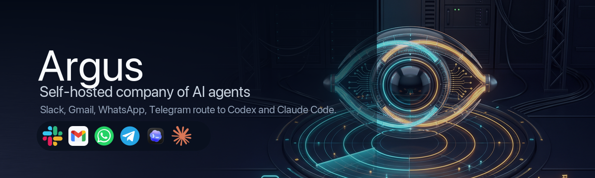

<p align="center">
  
</p>

# Argus Docs

Argus is a self-hosted company of AI agents. It watches repos, production
signals, support inboxes, and chat channels, then routes work through
approval-gated agents that can explain status, draft fixes, and open safe pull
requests.

This page is ready for GitHub Pages with the repository Pages source set to
`/docs`.

## Start By Goal

| Goal | Read |
|---|---|
| Understand the product vision | [Vision](https://github.com/dangogit/argus/blob/main/VISION.md) |
| Compare Argus to other agent projects | [Competitive Landscape](competitive.md) |
| See what is planned next | [Roadmap](https://github.com/dangogit/argus/blob/main/ROADMAP.md) |
| Install Argus from GitHub | [Install](https://github.com/dangogit/argus#install) |
| Prove local runtime with no model keys | [Quickstart](quickstart.md) |
| Let Codex or Claude Code install Argus | [Agent Guide](https://github.com/dangogit/argus/blob/main/AGENTS.md) and [Argus Live Onboarding Skill](https://github.com/dangogit/argus/blob/main/skills/argus-live-onboarding/SKILL.md) |
| Configure a real project | [Live Onboarding](live-onboarding.md) and [Configuration](configuration.md) |
| Make Slack live | [Live Slack Setup](slack-live.md) |
| Receive Telegram, WhatsApp, CLI, or webhook messages | [Inbound Channels](inbound.md) |
| Monitor production providers | [Connectors](triage.md) |
| Enable PM draft PRs | [PM Auto-Fix](pm.md) |
| Run daily team and company learning | [Retro](retro.md) |
| Run always-on workers | [Operations](operations.md) |
| Update or uninstall Argus | [Updating](updating.md) |
| Answer common setup questions | [FAQ](faq.md) |
| See common deployment paths | [Showcase](showcase.md) |
| Prepare a public repository launch | [Public Launch Checklist](public-launch.md) |
| Review trust boundaries | [Threat Model](threat-model.md) and [Security Policy](https://github.com/dangogit/argus/blob/main/SECURITY.md) |
| Understand code layout | [Architecture](architecture.md) |
| Ask a setup question | [GitHub Discussions](https://github.com/dangogit/argus/discussions) |

## Install

```bash
curl -fsSL https://raw.githubusercontent.com/dangogit/argus/main/scripts/install.sh | sh
argus --version
```

On macOS, install Homebrew Python if `/usr/bin/python3` is older than 3.11:

```bash
brew install python@3.12
```

## Live Proof

Argus has three proof levels:

| Command | What it proves |
|---|---|
| `argus validate` | Config shape and registered channel/connector names. |
| `argus doctor --deep` | Engines, repos, channels, and connector dry-runs. |
| `argus go-live` | DB migrated, receiver reachable, worker continuous, channel event received, reply sent, and PM smoke when enabled. |

Do not call a deployment operational while `go-live` reports `configured-only`
or `blocked`.

## Safety Defaults

- Self-hosted: your host, env, and installed engine CLI are the trust boundary.
- `echo` engine first: add Codex, Claude Code, or Hermes only after local smoke
  passes.
- PM mode proposes changes by default and opens draft PRs.
- Retro `auto-changes` can open internal PM requests only. Merge, deploy,
  outward messages, secrets, and destructive work stay approval gated.
- Secrets stay in env files or private overlays, not YAML or git.
- Slack and Telegram webhooks require configured secrets.

## Full Index

- [Quickstart](quickstart.md)
- [FAQ](faq.md)
- [Updating](updating.md)
- [Showcase](showcase.md)
- [Public Launch Checklist](public-launch.md)
- [Configuration](configuration.md)
- [Live Onboarding](live-onboarding.md)
- [Operations](operations.md)
- [PM Auto-Fix](pm.md)
- [Connectors](triage.md)
- [Inbound Channels](inbound.md)
- [Live Slack Setup](slack-live.md)
- [Support](support.md)
- [Content](content.md)
- [Context](context.md)
- [Advisor](advisor.md)
- [Assistant And Calendar](assistant.md)
- [Retro](retro.md)
- [Threat Model](threat-model.md)
- [Acceptance](v2-acceptance.md)
